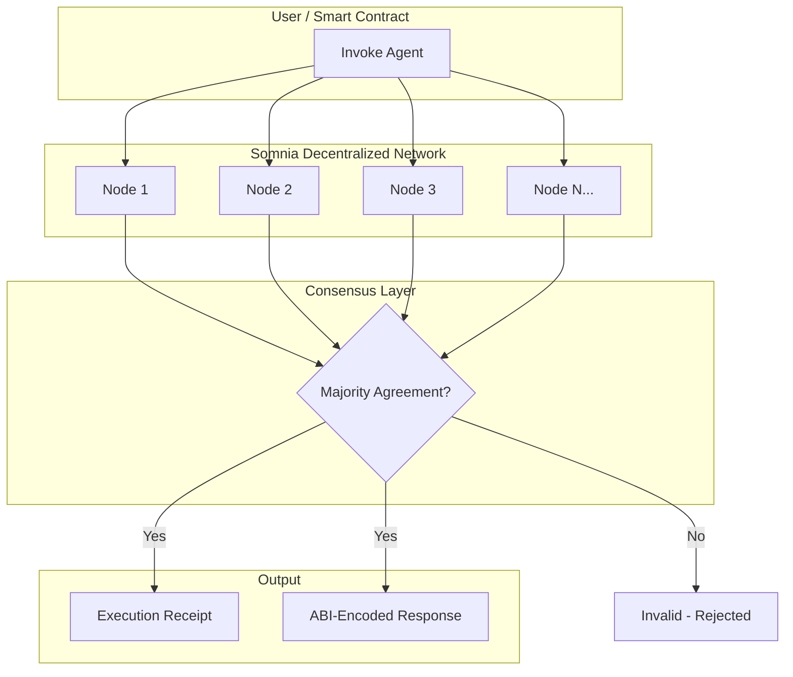
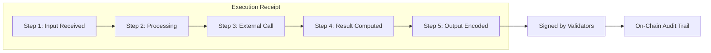
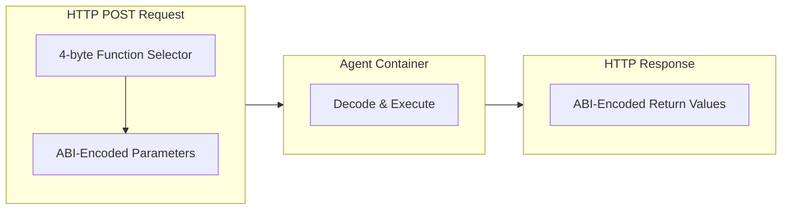
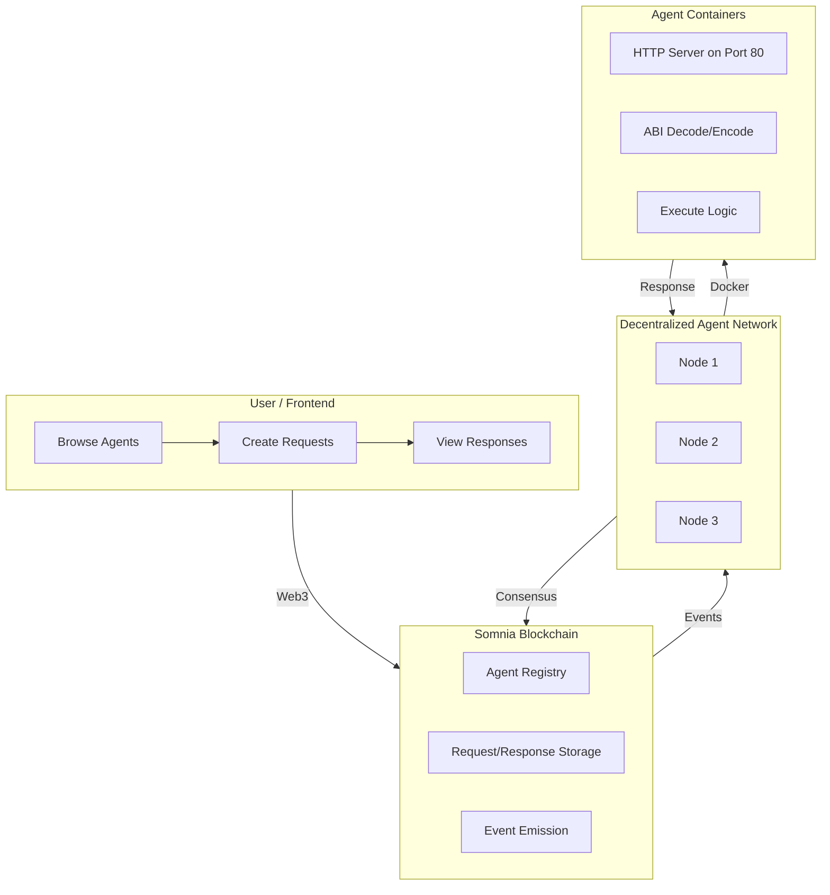
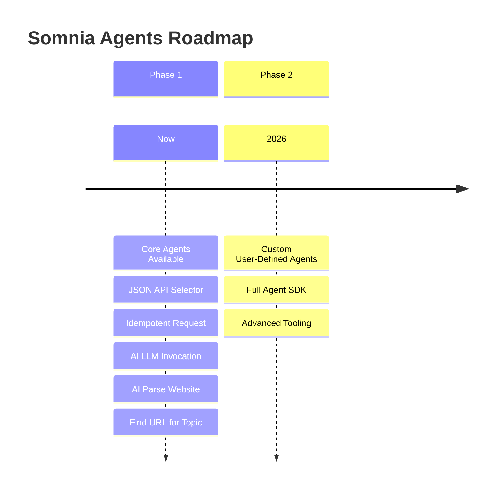

# Somnia Agents Platform - Overview

Somnia Agents extend the Somnia blockchain by enabling Smart Contracts and users to trigger decentralized, auditable compute jobs—including AI tasks—executed across Somnia's decentralized network. By integrating with Somnia's native on-chain reactivity, Agents make it possible to build and run fully featured decentralized applications.

## What are Somnia Agents?

Somnia Agents function as **decentralized, sandboxed compute containers**. This architecture makes them simple to develop, much like familiar serverless platforms such as AWS Lambda or Google Cloud Run, but with the advantages of blockchain auditability, reactivity, and security.

### Capabilities

Somnia Agents unlock use cases not possible with traditional EVM Smart Contracts:

- **Acting as Oracles:** Querying the internet and reliably bringing external data on-chain
- **Outbound Communication:** Triggering actions or sending messages to external internet services
- **AI Agents:** Leveraging on-chain deterministic AI models for autonomous agents and processing complex computation or jobs

## How Somnia Agents Work

### Execution

When an Agent is invoked, it runs on a **decentralized subset of the Somnia network nodes**. Execution is considered valid only when a majority of nodes reach consensus on the result. Each invocation produces an audit receipt, allowing anyone to retrospectively inspect each step in an Agent execution.

### Receipts

An execution receipt is a **signed manifest of intermediate computation steps** taken within the Agent. This is similar to the logs and manifests used by CI build systems.

### Payment and Metering

Invoking an Agent requires **SOMI tokens**. Charges are metered based on:
- Agent's compute time
- Resource usage (e.g., tokens utilized by large language models)

## EVM-Native Schema

Somnia Agents are invoked via **HTTP POST requests**, where both the input data and returned result are ABI-encoded, just like traditional Ethereum smart contract calls.

The interface and schema of each Agent closely follows the **standard Solidity contract ABI**. This means you can use familiar web3 tools—such as viem, Ethers.js, or Solidity's own ABI encoders/decoders—to interact with Agents in exactly the same way you would a smart contract.

**Key Benefits:**
- Code reuse with existing smart contract tooling
- Seamless integration with developer workflows
- Agents feel like native blockchain contracts
- Enables richer off-chain compute and connectivity

## Architecture Overview

## Platform Components

### 1. Agent Builder (CLI)

A command-line tool for creating and deploying agents:
- Initialize agent projects
- Define method specifications
- Build Docker containers
- Upload to IPFS
- Generate metadata

**Repository:** `/agent-builder/`

### 2. Agent Host (Service)

A Node.js service that executes agent requests:
- Listens to blockchain events
- Manages Docker containers
- Routes requests to agents
- Submits responses on-chain

**Repository:** `/agent-host/`

### 3. Frontend (Web Interface)

A Next.js web application for interacting with agents:
- Browse available agents
- Invoke agent methods
- View live events
- Manage responder nodes
- Mint new agents

**Repository:** `/frontend/`

### 4. Smart Contract

Solidity contracts deployed on Somnia blockchain:
- Agent NFT minting
- Request creation and payment
- Response handling
- Event emission

**Contract Address:** `0x9De7D7a7e0864be11F338b3D1bBfF3e982207160`

## Roadmap

Agents will roll out in phases:

**Phase 1 (Current):** A curated set of core Agents is available to the ecosystem, covering common use cases like oracles, AI, and external communication.

**Phase 2 (2026):** Support for fully custom, user-defined Agents will launch, further expanding Somnia's capabilities.

## Use Cases

### Oracles
- Price feeds from cryptocurrency APIs
- Weather data for parametric insurance
- Sports scores for prediction markets
- Any external API data

### AI Services
- Text generation and analysis
- Content moderation decisions
- Dynamic NFT descriptions
- Intelligent automation

### Outbound Communication
- Webhook triggers from smart contracts
- Notifications to external systems
- Off-chain workflow initiation
- Database synchronization

### Data Processing
- JSON extraction and transformation
- Web scraping with AI
- Data validation and enrichment
- Format conversion

## Key Features

- **EVM-Native**: Standard Solidity ABI encoding for seamless integration
- **Decentralized**: No central authority or single point of failure
- **Auditable**: Every execution produces verifiable receipts
- **Monetizable**: Earn fees from agent usage
- **Composable**: Agents can be chained together
- **Permissionless**: Anyone can invoke agents
- **Deterministic AI**: On-chain AI with consensus guarantees

## Network Information

| Property | Value |
|----------|-------|
| Blockchain | Somnia Mainnet |
| Chain ID | 5031 |
| RPC URL | `https://api.infra.mainnet.somnia.network/` |
| WebSocket | `wss://api.infra.mainnet.somnia.network/` |
| Block Explorer | [Somnia Explorer](https://explorer.somnia.network/) |
| Payment Token | SOMI |

## Next Steps

- [Explore Core Agents](./01-core-agents.md)
- [Learn about Agent Specifications](./02-agent-specification.md)
- [Build your first agent](./03-building-agents.md)
- [Understand ABI encoding](./06-abi-encoding.md)
- [Explore examples](./07-examples.md)
