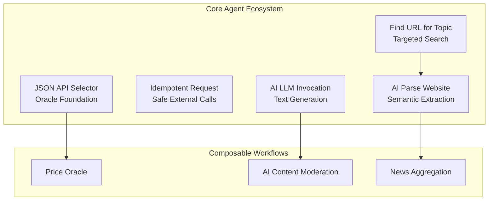
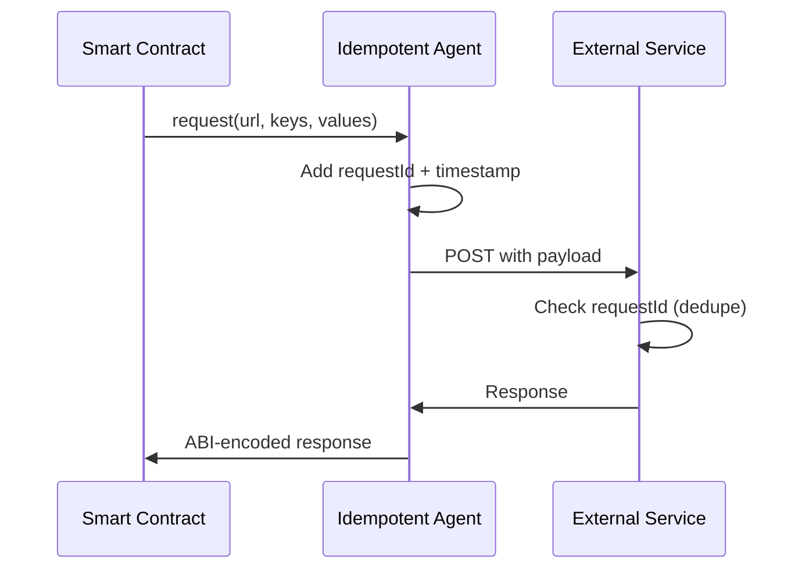
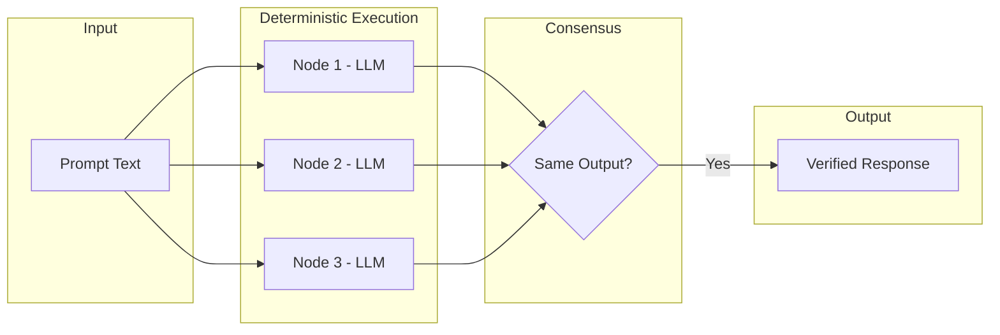
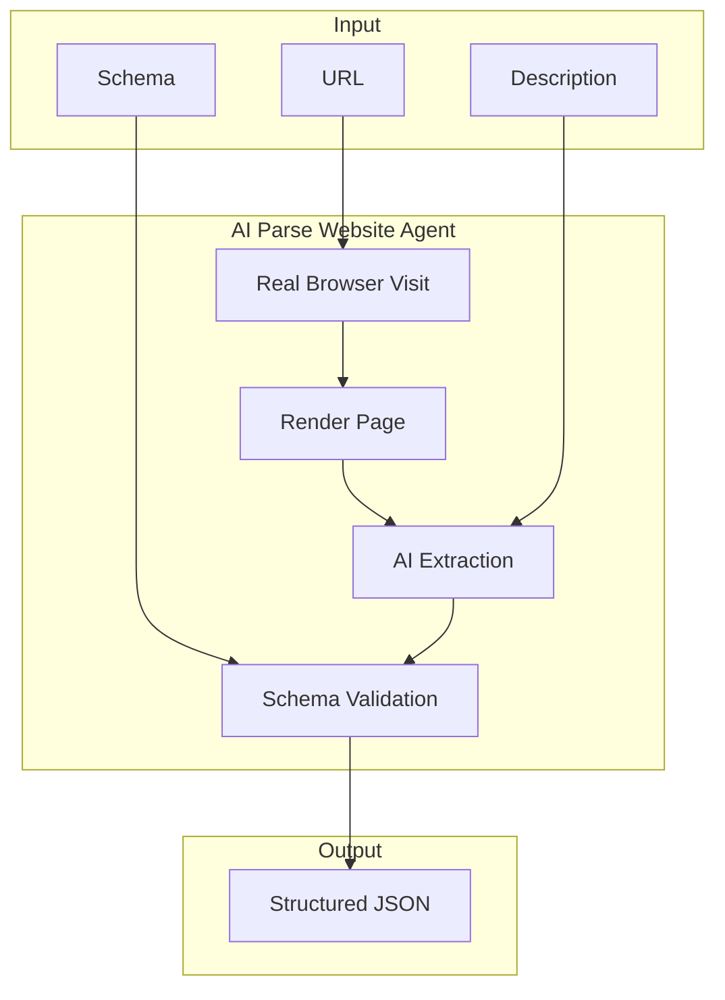
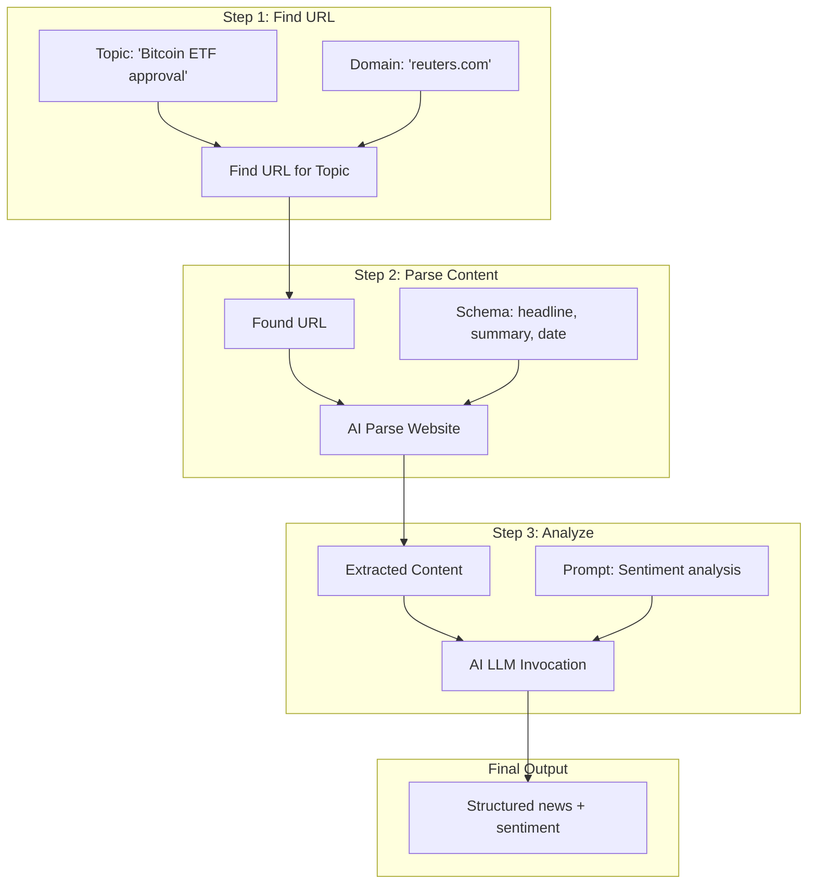

# Core Agents

The following agents are available as part of Somnia's core agent ecosystem. These agents cover common use cases and can be composed together to build sophisticated decentralized applications.



---

## JSON API Selector

Fetches JSON data from any public API endpoint and extracts specific values using a selector path. This agent is the fundamental building block for creating on-chain oracles.

### Method

```solidity
function fetch(string url, string selector) returns (string result)
```

### Parameters

| Input | Type | Description |
|-------|------|-------------|
| `url` | string | The URL of the JSON API endpoint to fetch |
| `selector` | string | A dot-notation path to extract from the response (e.g., `data.price` or `items[0].name`) |

### Returns

| Output | Type | Description |
|--------|------|-------------|
| `result` | string | The extracted value as a string |

### Example Use Cases

- Fetching cryptocurrency prices from CoinGecko or similar APIs
- Retrieving weather data for parametric insurance contracts
- Pulling sports scores for prediction markets
- Accessing any REST API that returns JSON

### Usage Example

```javascript
import { encodeFunctionData, decodeFunctionResult } from 'viem';

const abi = [{
  type: 'function',
  name: 'fetch',
  inputs: [
    { name: 'url', type: 'string' },
    { name: 'selector', type: 'string' }
  ],
  outputs: [{ name: 'result', type: 'string' }]
}];

// Fetch Bitcoin price from CoinGecko
const calldata = encodeFunctionData({
  abi,
  functionName: 'fetch',
  args: [
    'https://api.coingecko.com/api/v3/simple/price?ids=bitcoin&vs_currencies=usd',
    'bitcoin.usd'
  ]
});
```

---

## Idempotent Request

Performs HTTP POST requests to external services with built-in idempotency guarantees. Each request includes a unique Request ID, allowing external services to safely handle duplicate requests that may occur during consensus.

### Method

```solidity
function request(string url, string[] keys, string[] values) returns (string response)
```

### Parameters

| Input | Type | Description |
|-------|------|-------------|
| `url` | string | The URL to POST the request to |
| `keys` | string[] | Array of field names for the JSON payload |
| `values` | string[] | Array of corresponding field values |

### Returns

| Output | Type | Description |
|--------|------|-------------|
| `response` | string | The response from the external service |

### Automatic Fields

The agent automatically includes these fields in the payload:
- `requestId` - Unique identifier for deduplication
- `timestamp` - Request timestamp

This is critical for operations like payments or state changes where executing twice would be problematic.

### Example Use Cases

- Triggering webhooks from smart contracts
- Sending notifications to external messaging systems
- Initiating off-chain workflows from on-chain events
- Posting data to external databases or services

### Usage Example

```javascript
const abi = [{
  type: 'function',
  name: 'request',
  inputs: [
    { name: 'url', type: 'string' },
    { name: 'keys', type: 'string[]' },
    { name: 'values', type: 'string[]' }
  ],
  outputs: [{ name: 'response', type: 'string' }]
}];

// Trigger a webhook with payment data
const calldata = encodeFunctionData({
  abi,
  functionName: 'request',
  args: [
    'https://api.example.com/webhook/payment',
    ['action', 'amount', 'recipient'],
    ['transfer', '100', '0x742d35Cc6634C0532925a3b844Bc9e7595f0bEb']
  ]
});
```



---

## AI LLM Invocation

Provides access to Somnia's on-chain deterministic AI models for text generation, analysis, and decision-making. This agent enables smart contracts to leverage large language models for intelligent automation.

### Method

```solidity
function generate(string prompt) returns (string response)
```

### Parameters

| Input | Type | Description |
|-------|------|-------------|
| `prompt` | string | The text prompt to send to the model |

### Returns

| Output | Type | Description |
|--------|------|-------------|
| `response` | string | The generated text response |

### Deterministic Execution

Because the models run deterministically across all validating nodes, consensus can be achieved on the output, making AI results trustworthy for on-chain use.

### Example Use Cases

- Analyzing text content for moderation decisions
- Generating summaries of on-chain data
- Making classification decisions (sentiment, category, etc.)
- Creating dynamic NFT descriptions or game narratives

### Usage Example

```javascript
const abi = [{
  type: 'function',
  name: 'generate',
  inputs: [{ name: 'prompt', type: 'string' }],
  outputs: [{ name: 'response', type: 'string' }]
}];

// Content moderation example
const calldata = encodeFunctionData({
  abi,
  functionName: 'generate',
  args: [
    'Analyze the following text and respond with ONLY "safe" or "unsafe": ' +
    '"Check out this amazing new product!"'
  ]
});
```



---

## AI Parse Website

Extracts structured content from web pages using AI-based semantic extraction. Unlike the JSON API Selector, this agent can handle HTML pages and extract human-readable content, and sites are visited using a real web browser.

### Method

```solidity
function extract(string url, string description, string schema) returns (string content)
```

### Parameters

| Input | Type | Description |
|-------|------|-------------|
| `url` | string | The URL of the webpage to parse |
| `description` | string | Human-readable description of the content to extract (e.g., "Get the product details from this page") |
| `schema` | string | Define the expected structure of the extracted data, using JSON Schema or a plain-text format |

### Returns

| Output | Type | Description |
|--------|------|-------------|
| `content` | string | The extracted content matching the schema |

### Example Use Cases

- Scraping price information from e-commerce sites
- Extracting news headlines for on-chain curation
- Monitoring website content for changes
- Building oracles for data not available via APIs

### Usage Example

```javascript
const abi = [{
  type: 'function',
  name: 'extract',
  inputs: [
    { name: 'url', type: 'string' },
    { name: 'description', type: 'string' },
    { name: 'schema', type: 'string' }
  ],
  outputs: [{ name: 'content', type: 'string' }]
}];

// Extract product price from e-commerce site
const calldata = encodeFunctionData({
  abi,
  functionName: 'extract',
  args: [
    'https://example-store.com/product/12345',
    'Get the product name and current price',
    '{"name": "string", "price": "number", "currency": "string"}'
  ]
});
```



---

## Find URL for Topic

Searches a specified website to find the most relevant URL for a given topic. This agent acts as a targeted search engine, useful for discovering specific pages within large websites.

### Method

```solidity
function search(string domain, string topic) returns (string url)
```

### Parameters

| Input | Type | Description |
|-------|------|-------------|
| `domain` | string | The base domain to search within (e.g., `bbc.com`) |
| `topic` | string | The topic or keywords to search for (e.g., `2026 election results`) |

### Returns

| Output | Type | Description |
|--------|------|-------------|
| `url` | string | The most relevant URL found |

### Example Use Cases

- Finding the canonical URL for a news story across multiple sources
- Discovering product pages for price comparison oracles
- Locating documentation or reference material
- Building composable search workflows (find URL -> parse content -> extract data)

### Usage Example

```javascript
const abi = [{
  type: 'function',
  name: 'search',
  inputs: [
    { name: 'domain', type: 'string' },
    { name: 'topic', type: 'string' }
  ],
  outputs: [{ name: 'url', type: 'string' }]
}];

// Find news article about specific topic
const calldata = encodeFunctionData({
  abi,
  functionName: 'search',
  args: [
    'bbc.com',
    '2026 election results'
  ]
});
```

---

## Composing Agents

Core agents can be composed together to build sophisticated workflows. Here's an example of a news aggregation pipeline:



### Workflow Example Code

```javascript
// Step 1: Find the URL
const findUrlResult = await invokeAgent('find-url', 'search', {
  domain: 'reuters.com',
  topic: 'Bitcoin ETF approval'
});

// Step 2: Parse the content
const parseResult = await invokeAgent('ai-parse-website', 'extract', {
  url: findUrlResult,
  description: 'Extract the main article content',
  schema: '{"headline": "string", "summary": "string", "date": "string"}'
});

// Step 3: Analyze with AI
const analysisResult = await invokeAgent('ai-llm', 'generate', {
  prompt: `Analyze the sentiment of this news: ${parseResult}.
           Respond with: BULLISH, BEARISH, or NEUTRAL`
});
```

---

## Next Steps

- [Learn about Agent Definitions](./02-agent-specification.md)
- [Understand container requirements](./03-container-requirements.md)
- [Learn about ABI encoding](./04-abi-encoding.md)
- [See implementation examples](./05-examples.md)
