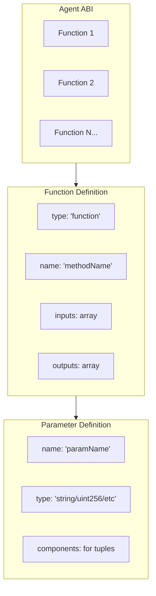
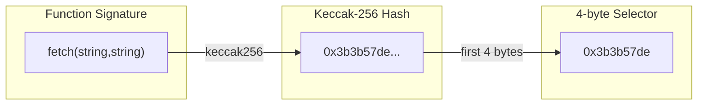
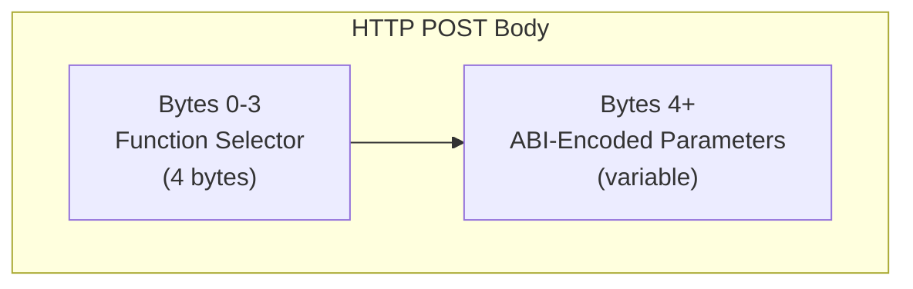
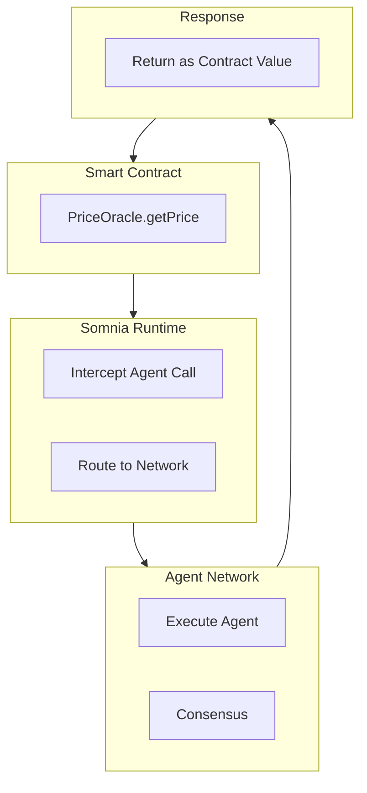

# Agent Definition

Somnia Agents are defined by two components: a **metadata JSON** file that describes the agent's interface and properties, and a **container image** that implements the agent's logic.

## Metadata JSON

The metadata JSON file defines the agent's identity, capabilities, and ABI-compatible interface. This specification intentionally mirrors the Ethereum ABI format, allowing developers to use familiar web3 tooling.

### Complete Schema

```json
{
  "name": "json-selector",
  "description": "Fetches JSON from a URL and extracts values using selectors",
  "image": "https://example.com/agent-logo.png",
  "container_image": "ipfs://QmExampleContainerCID",
  "version": "1.0.0",
  "author": "Somnia Team",
  "abi": [
    {
      "type": "function",
      "name": "fetch",
      "inputs": [
        { "name": "url", "type": "string" },
        { "name": "selector", "type": "string" }
      ],
      "outputs": [
        { "name": "result", "type": "string" }
      ]
    }
  ],
  "tags": ["utility", "json", "oracle"],
  "homepage": "https://somnia.network/agents/json-selector",
  "repository": "https://github.com/example/json-selector-agent",
  "external_url": "https://somnia.network/agents/1",
  "attributes": [
    { "trait_type": "Category", "value": "Oracle" },
    { "trait_type": "Complexity", "value": "Simple" }
  ]
}
```

### Required Fields

| Field | Type | Description |
|-------|------|-------------|
| `name` | string | Human-readable agent name |
| `description` | string | Brief description of what the agent does |
| `container_image` | string | URL or IPFS CID of the container image |
| `version` | string | Semantic version (e.g., "1.0.0") |
| `abi` | array | Array of function definitions (Ethereum ABI format) |

### Optional Fields

| Field | Type | Description |
|-------|------|-------------|
| `image` | string | URL to agent logo/avatar image |
| `author` | string | Creator name or organization |
| `tags` | string[] | Tags for discovery and categorization |
| `homepage` | string | Documentation or website URL |
| `repository` | string | Source code repository URL |
| `external_url` | string | Link for NFT marketplaces |
| `attributes` | array | NFT-style trait attributes |

---

## ABI Format

The `abi` field uses the **Ethereum ABI specification** format. Each entry defines a function the agent exposes.



### Function Definition

```json
{
  "type": "function",
  "name": "methodName",
  "inputs": [
    { "name": "param1", "type": "string" },
    { "name": "param2", "type": "uint256" }
  ],
  "outputs": [
    { "name": "result", "type": "string" }
  ]
}
```

| Field | Required | Description |
|-------|----------|-------------|
| `type` | Yes | Always `"function"` for agent methods |
| `name` | Yes | Method name (used to compute function selector) |
| `inputs` | Yes | Array of input parameters |
| `outputs` | Yes | Array of output parameters |

### Parameter Definition

Each input/output parameter follows the Ethereum ABI parameter format:

```json
{
  "name": "paramName",
  "type": "string",
  "components": []
}
```

The `components` field is only required for `tuple` types.

### Supported Types

| Type | Description | Example |
|------|-------------|---------|
| `string` | UTF-8 text | `"hello world"` |
| `uint256` | Unsigned 256-bit integer | `12345` |
| `int256` | Signed 256-bit integer | `-100` |
| `bool` | Boolean | `true` |
| `address` | Ethereum address (20 bytes) | `0x742d...` |
| `bytes` | Dynamic byte array | `0x1234` |
| `bytes32` | Fixed 32-byte array | `0x00...00` |
| `string[]` | Array of strings | `["a", "b"]` |
| `uint256[]` | Array of integers | `[1, 2, 3]` |
| `tuple` | Struct/complex type | See below |

### Tuple Types (Structs)

For complex structured data, use the `tuple` type with `components`:

```json
{
  "type": "function",
  "name": "processUser",
  "inputs": [
    {
      "name": "user",
      "type": "tuple",
      "components": [
        { "name": "name", "type": "string" },
        { "name": "age", "type": "uint256" },
        { "name": "wallet", "type": "address" }
      ]
    }
  ],
  "outputs": [
    { "name": "success", "type": "bool" }
  ]
}
```

---

## Function Selector Encoding

Agent invocations use the **exact same encoding as Ethereum contract calls**. The request body consists of:

```
[4-byte function selector] + [ABI-encoded parameters]
```



### Computing the Function Selector

The function selector is the first 4 bytes of the Keccak-256 hash of the function signature:

```
selector = keccak256("functionName(type1,type2,...)")[0:4]
```

**Example:** For `fetch(string,string)`:

```javascript
import { keccak256, toBytes, slice } from 'viem';

const signature = "fetch(string,string)";
const hash = keccak256(toBytes(signature));
const selector = slice(hash, 0, 4);
// selector = 0x3b3b57de (example)
```

### Request Format

The full request body sent to the agent container:

```
┌─────────────────────────────────────────────────────────────────┐
│  Bytes 0-3    │  Bytes 4+                                       │
│  Selector     │  ABI-encoded parameters                         │
│  (4 bytes)    │  (variable length)                              │
└─────────────────────────────────────────────────────────────────┘
```



### Response Format

The agent returns **only the ABI-encoded outputs** (no selector):

```
┌─────────────────────────────────────────────────────────────────┐
│  ABI-encoded return values                                      │
│  (variable length)                                              │
└─────────────────────────────────────────────────────────────────┘
```

---

## Encoding Examples

### Example 1: Simple String Method

**ABI Definition:**
```json
{
  "type": "function",
  "name": "greet",
  "inputs": [{ "name": "name", "type": "string" }],
  "outputs": [{ "name": "greeting", "type": "string" }]
}
```

**Encoding with viem:**
```javascript
import { encodeFunctionData, decodeFunctionResult } from 'viem';

const abi = [{
  type: 'function',
  name: 'greet',
  inputs: [{ name: 'name', type: 'string' }],
  outputs: [{ name: 'greeting', type: 'string' }]
}];

// Encode request (includes 4-byte selector)
const calldata = encodeFunctionData({
  abi,
  functionName: 'greet',
  args: ['Alice']
});
// calldata = 0xead710c4000...

// Send to agent
const response = await fetch(agentUrl, {
  method: 'POST',
  body: Buffer.from(calldata.slice(2), 'hex')
});

// Decode response
const responseHex = '0x' + Buffer.from(await response.arrayBuffer()).toString('hex');
const result = decodeFunctionResult({
  abi,
  functionName: 'greet',
  data: responseHex
});
// result = "Hello, Alice!"
```

### Example 2: Multiple Parameters

**ABI Definition:**
```json
{
  "type": "function",
  "name": "request",
  "inputs": [
    { "name": "url", "type": "string" },
    { "name": "keys", "type": "string[]" },
    { "name": "values", "type": "string[]" }
  ],
  "outputs": [{ "name": "response", "type": "string" }]
}
```

**Signature:** `request(string,string[],string[])`

**Encoding:**
```javascript
const calldata = encodeFunctionData({
  abi,
  functionName: 'request',
  args: [
    'https://api.example.com/webhook',
    ['action', 'amount'],
    ['transfer', '100']
  ]
});
```

### Example 3: Tuple Parameters

**ABI Definition:**
```json
{
  "type": "function",
  "name": "createOrder",
  "inputs": [
    {
      "name": "order",
      "type": "tuple",
      "components": [
        { "name": "item", "type": "string" },
        { "name": "quantity", "type": "uint256" },
        { "name": "recipient", "type": "address" }
      ]
    }
  ],
  "outputs": [
    { "name": "orderId", "type": "bytes32" },
    { "name": "success", "type": "bool" }
  ]
}
```

**Signature:** `createOrder((string,uint256,address))`

**Encoding:**
```javascript
const calldata = encodeFunctionData({
  abi,
  functionName: 'createOrder',
  args: [{
    item: 'Widget',
    quantity: 5n,
    recipient: '0x742d35Cc6634C0532925a3b844Bc9e7595f0bEb'
  }]
});
```

---

## Complete Metadata Examples

### JSON Selector Agent

```json
{
  "name": "JSON Selector",
  "description": "Fetches JSON from any URL and extracts values using selector paths",
  "container_image": "ipfs://QmJsonSelectorCID",
  "version": "1.0.0",
  "author": "Somnia Team",
  "abi": [
    {
      "type": "function",
      "name": "fetch",
      "inputs": [
        { "name": "url", "type": "string" },
        { "name": "selector", "type": "string" }
      ],
      "outputs": [
        { "name": "result", "type": "string" }
      ]
    }
  ],
  "tags": ["oracle", "json", "api"]
}
```

### LLM Invocation Agent

```json
{
  "name": "AI Generate",
  "description": "Generate text using Somnia's on-chain deterministic AI",
  "container_image": "ipfs://QmLLMAgentCID",
  "version": "1.0.0",
  "author": "Somnia Team",
  "abi": [
    {
      "type": "function",
      "name": "generate",
      "inputs": [
        { "name": "prompt", "type": "string" }
      ],
      "outputs": [
        { "name": "response", "type": "string" }
      ]
    },
    {
      "type": "function",
      "name": "chat",
      "inputs": [
        { "name": "messages", "type": "string[]" },
        { "name": "roles", "type": "string[]" }
      ],
      "outputs": [
        { "name": "response", "type": "string" }
      ]
    }
  ],
  "tags": ["ai", "llm", "generate"]
}
```

### Multi-Output Agent

```json
{
  "name": "Data Processor",
  "description": "Process data with multiple return values",
  "container_image": "ipfs://QmDataProcessorCID",
  "version": "1.0.0",
  "author": "Somnia Team",
  "abi": [
    {
      "type": "function",
      "name": "analyze",
      "inputs": [
        { "name": "data", "type": "bytes" }
      ],
      "outputs": [
        { "name": "hash", "type": "bytes32" },
        { "name": "size", "type": "uint256" },
        { "name": "valid", "type": "bool" }
      ]
    }
  ]
}
```

---

## Generating ABI from Solidity Interface

You can define your agent interface using Solidity syntax and compile it to get the ABI:

```solidity
// IJsonSelector.sol
interface IJsonSelector {
    function fetch(string calldata url, string calldata selector)
        external
        returns (string memory result);
}
```

Compile with `solc --abi IJsonSelector.sol` to generate:

```json
[
  {
    "type": "function",
    "name": "fetch",
    "inputs": [
      { "name": "url", "type": "string" },
      { "name": "selector", "type": "string" }
    ],
    "outputs": [
      { "name": "result", "type": "string" }
    ],
    "stateMutability": "nonpayable"
  }
]
```

This ABI can be used directly in your metadata.json.

---

## Smart Contract Integration

Because agents use the same ABI encoding as smart contracts, integration is seamless:

```solidity
// SPDX-License-Identifier: MIT
pragma solidity ^0.8.0;

interface IJsonSelector {
    function fetch(string calldata url, string calldata selector)
        external returns (string memory);
}

contract PriceOracle {
    address public jsonAgent;

    constructor(address _jsonAgent) {
        jsonAgent = _jsonAgent;
    }

    function getPrice(string calldata apiUrl, string calldata path)
        external
        returns (string memory)
    {
        // The calldata encoding is identical to a contract call
        return IJsonSelector(jsonAgent).fetch(apiUrl, path);
    }
}
```

The Somnia runtime intercepts calls to agent addresses and routes them to the decentralized agent network, returning results as if they were contract return values.



---

## Validation Rules

When creating agent metadata, ensure:

- Method names must be valid Solidity identifiers
- All parameter types must be valid ABI types
- Tuple types must have a `components` array
- Array types must use `[]` or `[N]` syntax
- No duplicate method names
- No duplicate parameter names within a method
- Version must follow semantic versioning

## Best Practices

### Naming Conventions

- **Agent names**: Human-readable, descriptive
- **Method names**: camelCase (e.g., `getUserData`)
- **Parameter names**: camelCase (e.g., `userName`, `maxResults`)

### Documentation

- Always include `description` fields
- Describe input/output parameters clearly
- Include usage examples in agent homepage
- Document any limitations or requirements

### Versioning

Use semantic versioning:
- **Major** (1.0.0 -> 2.0.0): Breaking changes
- **Minor** (1.0.0 -> 1.1.0): New features, backward compatible
- **Patch** (1.0.0 -> 1.0.1): Bug fixes

---

## Next Steps

- [Understand container requirements](./03-container-requirements.md)
- [Learn about ABI encoding](./04-abi-encoding.md)
- [See implementation examples](./05-examples.md)
- [Explore core agents](./01-core-agents.md)
