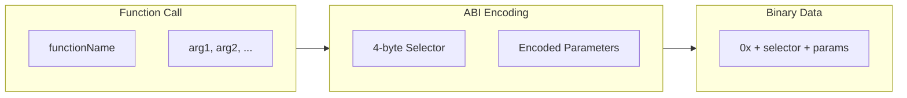
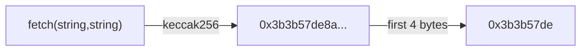

# ABI Encoding and Decoding

Somnia Agents use **Ethereum ABI (Application Binary Interface)** encoding for all method invocations and responses. This ensures type safety, cross-language compatibility, and seamless integration with blockchain tools.

## What is ABI Encoding?

ABI encoding is the standard way Ethereum encodes function calls and data. It provides:

- **Type safety**: Strict type checking
- **Deterministic encoding**: Same input always produces same output
- **Cross-language support**: Works with any language
- **Blockchain compatibility**: Direct integration with smart contracts



## Function Selectors

Every function call in Somnia Agents begins with a **4-byte function selector**. This selector identifies which function to call.

### Computing the Selector

The selector is the first 4 bytes of the Keccak-256 hash of the function signature:

```
selector = keccak256("functionName(type1,type2,...)")[0:4]
```



### Examples

| Function Signature | Selector |
|-------------------|----------|
| `greet(string)` | `0xead710c4` |
| `fetch(string,string)` | `0x3b3b57de` |
| `generate(string)` | `0xa9059cbb` |
| `add(uint256,uint256)` | `0x771602f7` |

### Computing with viem

```javascript
import { keccak256, toBytes, slice } from 'viem';

// Compute selector for fetch(string,string)
const signature = "fetch(string,string)";
const hash = keccak256(toBytes(signature));
const selector = slice(hash, 0, 4);

console.log(selector); // 0x3b3b57de
```

### Computing with ethers.js

```javascript
import { utils } from 'ethers';

const signature = "fetch(string,string)";
const selector = utils.id(signature).slice(0, 10);

console.log(selector); // 0x3b3b57de
```

---

## Request/Response Format

### Request Format

Agent requests contain:
1. **4-byte function selector**
2. **ABI-encoded parameters**

```
┌─────────────────────────────────────────────────────────────────┐
│  Bytes 0-3    │  Bytes 4+                                       │
│  Selector     │  ABI-encoded parameters                         │
│  (4 bytes)    │  (variable length)                              │
└─────────────────────────────────────────────────────────────────┘
```

### Response Format

Agent responses contain **only ABI-encoded outputs** (no selector):

```
┌─────────────────────────────────────────────────────────────────┐
│  ABI-encoded return values                                      │
│  (variable length)                                              │
└─────────────────────────────────────────────────────────────────┘
```

---

## ABI Types Reference

### Elementary Types

| Type | Description | Example Value | Encoded Size |
|------|-------------|---------------|--------------|
| `uint256` | Unsigned 256-bit integer | `12345` | 32 bytes |
| `uint8` to `uint256` | Unsigned integers (8-256 bits) | `255` | 32 bytes |
| `int256` | Signed 256-bit integer | `-100` | 32 bytes |
| `address` | Ethereum address (20 bytes) | `0x742d35Cc...` | 32 bytes |
| `bool` | Boolean value | `true` | 32 bytes |
| `bytes` | Dynamic byte array | `0x1234` | Dynamic |
| `bytes1` to `bytes32` | Fixed byte arrays | `0x00...` | 32 bytes |
| `string` | UTF-8 string | `"hello"` | Dynamic |

### Dynamic vs Static Types

**Static types** (fixed size):
- `uint256`, `int256`, `address`, `bool`
- `bytes1` to `bytes32`
- Fixed-size arrays like `uint256[3]`

**Dynamic types** (variable size):
- `string`
- `bytes`
- Arrays with `[]` like `uint256[]`
- Tuples containing dynamic types

---

## Encoding with viem (Recommended)

### Using encodeFunctionData

The easiest way to encode function calls is with `encodeFunctionData`:

```javascript
import { encodeFunctionData, decodeFunctionResult } from 'viem';

const abi = [{
  type: 'function',
  name: 'fetch',
  inputs: [
    { name: 'url', type: 'string' },
    { name: 'selector', type: 'string' }
  ],
  outputs: [{ name: 'result', type: 'string' }]
}];

// Encode request (includes 4-byte selector automatically)
const calldata = encodeFunctionData({
  abi,
  functionName: 'fetch',
  args: ['https://api.example.com/data', 'price']
});

console.log(calldata);
// 0x3b3b57de000000000000...
```

### Sending to Agent

```javascript
// Send to agent container
const response = await fetch('http://agent-url/', {
  method: 'POST',
  body: Buffer.from(calldata.slice(2), 'hex')
});

// Decode response
const responseHex = '0x' + Buffer.from(await response.arrayBuffer()).toString('hex');
const result = decodeFunctionResult({
  abi,
  functionName: 'fetch',
  data: responseHex
});

console.log(result); // "42.50"
```

### Using encodeAbiParameters (Raw Encoding)

For encoding just the parameters without a selector:

```javascript
import { encodeAbiParameters, decodeAbiParameters } from 'viem';

// Encode parameters only
const encoded = encodeAbiParameters(
  [{ type: 'string' }, { type: 'uint256' }],
  ['Alice', 25n]
);

// Decode parameters
const [name, age] = decodeAbiParameters(
  [{ type: 'string' }, { type: 'uint256' }],
  encoded
);
```

---

## Encoding Examples

### Single Value Encoding

**String:**
```javascript
const encoded = encodeAbiParameters(
  [{ type: 'string' }],
  ['hello world']
);
```

**uint256:**
```javascript
const encoded = encodeAbiParameters(
  [{ type: 'uint256' }],
  [12345n]
);
```

**Address:**
```javascript
const encoded = encodeAbiParameters(
  [{ type: 'address' }],
  ['0x742d35Cc6634C0532925a3b844Bc9e7595f0bEb']
);
```

### Multiple Values

```javascript
const encoded = encodeAbiParameters(
  [
    { type: 'string', name: 'name' },
    { type: 'uint256', name: 'age' },
    { type: 'bool', name: 'active' }
  ],
  ['Alice', 25n, true]
);
```

### Arrays

**Dynamic array:**
```javascript
const encoded = encodeAbiParameters(
  [{ type: 'uint256[]' }],
  [[1n, 2n, 3n, 4n, 5n]]
);
```

**String array:**
```javascript
const encoded = encodeAbiParameters(
  [{ type: 'string[]' }],
  [['hello', 'world', 'foo']]
);
```

### Tuples (Structs)

**Simple tuple:**
```javascript
const encoded = encodeAbiParameters(
  [
    {
      type: 'tuple',
      components: [
        { name: 'name', type: 'string' },
        { name: 'age', type: 'uint256' }
      ]
    }
  ],
  [{ name: 'Alice', age: 25n }]
);
```

**Nested tuple:**
```javascript
const encoded = encodeAbiParameters(
  [
    {
      type: 'tuple',
      components: [
        { name: 'name', type: 'string' },
        {
          name: 'address',
          type: 'tuple',
          components: [
            { name: 'street', type: 'string' },
            { name: 'city', type: 'string' }
          ]
        }
      ]
    }
  ],
  [{
    name: 'Alice',
    address: {
      street: '123 Main St',
      city: 'New York'
    }
  }]
);
```

---

## Decoding Examples

### Single Value Decoding

```javascript
import { decodeAbiParameters } from 'viem';

const decoded = decodeAbiParameters(
  [{ type: 'string' }],
  encodedData
);

console.log(decoded); // ['hello world']
```

### Multiple Values with Destructuring

```javascript
const [name, age, active] = decodeAbiParameters(
  [
    { type: 'string' },
    { type: 'uint256' },
    { type: 'bool' }
  ],
  encodedData
);
```

### Decoding Function Results

```javascript
const result = decodeFunctionResult({
  abi,
  functionName: 'fetch',
  data: responseHex
});
```

---

## Agent Container Implementation

### Complete Node.js Example with Function Selectors

```javascript
const express = require('express');
const { decodeFunctionData, encodeFunctionResult, keccak256, toBytes, slice } = require('viem');

const app = express();
app.use(express.raw({ type: '*/*', limit: '10mb' }));

const abi = [
  {
    type: 'function',
    name: 'greet',
    inputs: [{ name: 'name', type: 'string' }],
    outputs: [{ name: 'greeting', type: 'string' }]
  },
  {
    type: 'function',
    name: 'add',
    inputs: [
      { name: 'a', type: 'uint256' },
      { name: 'b', type: 'uint256' }
    ],
    outputs: [{ name: 'sum', type: 'uint256' }]
  }
];

// Compute selectors at startup
const selectors = {};
for (const fn of abi.filter(x => x.type === 'function')) {
  const sig = `${fn.name}(${fn.inputs.map(i => i.type).join(',')})`;
  const hash = keccak256(toBytes(sig));
  selectors[slice(hash, 0, 4)] = fn;
}

app.post('/', (req, res) => {
  try {
    const data = '0x' + req.body.toString('hex');
    const { functionName, args } = decodeFunctionData({ abi, data });

    let result;
    switch (functionName) {
      case 'greet':
        result = `Hello, ${args[0]}!`;
        break;
      case 'add':
        result = args[0] + args[1];
        break;
      default:
        return res.status(400).send('Unknown function');
    }

    const encoded = encodeFunctionResult({
      abi,
      functionName,
      result: Array.isArray(result) ? result : [result]
    });

    res.send(Buffer.from(encoded.slice(2), 'hex'));
  } catch (error) {
    console.error('Error:', error);
    res.status(500).send('Error processing request');
  }
});

app.listen(80);
```

### Python Implementation

```python
from flask import Flask, request, Response
from eth_abi import decode, encode
from eth_utils import keccak

app = Flask(__name__)

# Define ABI
ABI = {
    'greet': {'inputs': ['string'], 'outputs': ['string']},
    'add': {'inputs': ['uint256', 'uint256'], 'outputs': ['uint256']}
}

# Compute selectors
SELECTORS = {}
for name, spec in ABI.items():
    sig = f"{name}({','.join(spec['inputs'])})"
    selector = keccak(text=sig)[:4]
    SELECTORS[selector] = (name, spec)

@app.route('/', methods=['POST'])
def handle_request():
    try:
        raw_data = request.get_data()
        selector = raw_data[:4]
        params = raw_data[4:]

        if selector not in SELECTORS:
            return 'Unknown selector', 400

        name, spec = SELECTORS[selector]
        args = decode(spec['inputs'], params)

        if name == 'greet':
            result = f"Hello, {args[0]}!"
        elif name == 'add':
            result = args[0] + args[1]

        encoded = encode(spec['outputs'], [result])
        return Response(encoded, mimetype='application/octet-stream')

    except Exception as e:
        return str(e), 500

if __name__ == '__main__':
    app.run(host='0.0.0.0', port=80)
```

---

## Common Pitfalls

### BigInt Handling

JavaScript numbers are not precise enough for uint256:

```javascript
// Wrong - loses precision
const value = 123456789012345678901234567890;

// Correct - use BigInt
const value = 123456789012345678901234567890n;
```

### Hex String Format

Always include `0x` prefix:

```javascript
// Wrong
const hex = buffer.toString('hex');

// Correct
const hex = '0x' + buffer.toString('hex');
```

### Buffer Conversion

```javascript
// Hex string to Buffer (remove 0x prefix)
const buffer = Buffer.from(hex.slice(2), 'hex');

// Buffer to hex string (add 0x prefix)
const hex = '0x' + buffer.toString('hex');
```

### Function Signature Format

Signatures must be exact - no spaces, canonical types:

```javascript
// Wrong
const sig = "fetch( string, string )";
const sig = "fetch(String,String)";

// Correct
const sig = "fetch(string,string)";
```

---

## Tools and Libraries

### JavaScript/TypeScript

- **viem**: Modern, TypeScript-first (recommended)
- **ethers.js**: Popular, comprehensive
- **web3.js**: Original library

### Python

- **eth-abi**: Official implementation
- **web3.py**: Full Web3 library

### Go

- **go-ethereum (geth)**: Official Go implementation

### Rust

- **ethabi**: Rust ABI encoder/decoder

### Other Languages

- **Java**: web3j
- **C#**: Nethereum
- **Ruby**: ethereum.rb

---

## Testing ABI Encoding

### Using Agent Builder

```bash
# Test method with encoded input
agent-builder test --method greet --input '{"name": "Alice"}'
```

### Manual Testing with Node.js

```javascript
import { encodeFunctionData, decodeFunctionResult } from 'viem';

const abi = [{
  type: 'function',
  name: 'greet',
  inputs: [{ name: 'name', type: 'string' }],
  outputs: [{ name: 'greeting', type: 'string' }]
}];

// Encode request
const calldata = encodeFunctionData({
  abi,
  functionName: 'greet',
  args: ['Alice']
});

// Send to agent (note: root path /)
const response = await fetch('http://localhost:8080/', {
  method: 'POST',
  body: Buffer.from(calldata.slice(2), 'hex')
});

// Decode response
const responseHex = '0x' + Buffer.from(await response.arrayBuffer()).toString('hex');
const result = decodeFunctionResult({
  abi,
  functionName: 'greet',
  data: responseHex
});

console.log(result); // "Hello, Alice!"
```

---

## Performance Considerations

### Encoding Cost

- Static types: Constant time O(1)
- Dynamic types: Linear with data size O(n)
- Arrays: Linear with array length O(n)
- Tuples: Sum of component costs

### Optimization Tips

- Compute function selectors at startup, not per-request
- Cache ABI type definitions
- Reuse Buffer objects
- Use fixed types when possible

---

## Next Steps

- [See implementation examples](./05-examples.md)
- [Understand container requirements](./03-container-requirements.md)
- [Learn about agent definitions](./02-agent-specification.md)
