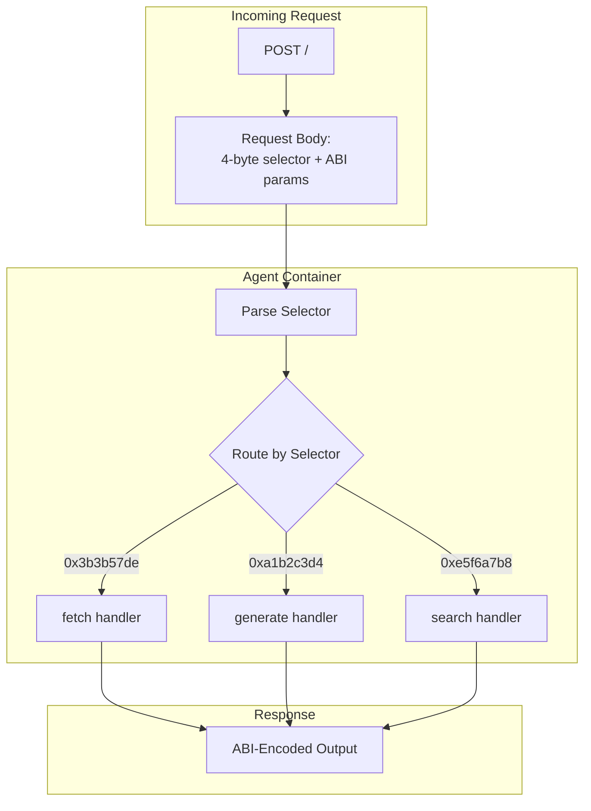

# Agent Container Requirements

This document specifies the requirements for agent Docker containers to work with the Somnia Agent platform.

## Core Requirements

### 1. HTTP Server on Port 80

Your container **must** run an HTTP server listening on **port 80**.

```javascript
// Example with Express.js
const app = express();
app.listen(80, () => {
  console.log('Agent listening on port 80');
});
```

```python
# Example with Flask
from flask import Flask
app = Flask(__name__)

if __name__ == '__main__':
    app.run(host='0.0.0.0', port=80)
```

### 2. Single Root Endpoint with Function Selector Routing

Agents receive all requests at a **single POST endpoint (`/`)** and route based on the 4-byte function selector in the request body.



**Important:** Unlike traditional REST APIs, agents do NOT have separate endpoints for each method. All requests go to `/` and are dispatched based on the function selector.

### 3. Request Format

The request body contains:
- **Bytes 0-3**: 4-byte function selector
- **Bytes 4+**: ABI-encoded parameters

```
┌─────────────────────────────────────────────────────────────────┐
│  Bytes 0-3    │  Bytes 4+                                       │
│  Selector     │  ABI-encoded parameters                         │
│  (4 bytes)    │  (variable length)                              │
└─────────────────────────────────────────────────────────────────┘
```

### 4. Response Format

The response body contains **only ABI-encoded outputs** (no selector):

```
┌─────────────────────────────────────────────────────────────────┐
│  ABI-encoded return values                                      │
│  (variable length)                                              │
└─────────────────────────────────────────────────────────────────┘
```

### 5. Error Handling

Return appropriate HTTP status codes:
- **200**: Success
- **400**: Invalid input (bad ABI encoding, validation failed, unknown selector)
- **500**: Internal server error
- **503**: Service unavailable (temporary)

---

## Implementation Guide

### Node.js Implementation (Recommended)

Using **viem** with function selector routing:

```javascript
const express = require('express');
const { decodeFunctionData, encodeFunctionResult, keccak256, toBytes, slice } = require('viem');

const app = express();
app.use(express.raw({ type: '*/*', limit: '10mb' }));

// Define your agent's ABI
const abi = [
  {
    type: 'function',
    name: 'greet',
    inputs: [{ name: 'name', type: 'string' }],
    outputs: [{ name: 'greeting', type: 'string' }]
  },
  {
    type: 'function',
    name: 'add',
    inputs: [
      { name: 'a', type: 'uint256' },
      { name: 'b', type: 'uint256' }
    ],
    outputs: [{ name: 'sum', type: 'uint256' }]
  }
];

// Compute selectors at startup
const selectors = {};
for (const fn of abi.filter(x => x.type === 'function')) {
  const sig = `${fn.name}(${fn.inputs.map(i => i.type).join(',')})`;
  const hash = keccak256(toBytes(sig));
  selectors[slice(hash, 0, 4)] = fn;
}

// Single root endpoint handles all requests
app.post('/', (req, res) => {
  try {
    const data = '0x' + req.body.toString('hex');
    const selector = data.slice(0, 10); // 0x + 8 hex chars = 4 bytes

    const fn = selectors[selector];
    if (!fn) {
      return res.status(400).send('Unknown function selector');
    }

    // Decode the full calldata
    const { args } = decodeFunctionData({ abi, data });

    // Route to handler based on function name
    let result;
    switch (fn.name) {
      case 'greet':
        result = `Hello, ${args[0]}!`;
        break;
      case 'add':
        result = args[0] + args[1];
        break;
      default:
        return res.status(400).send('Not implemented');
    }

    // Encode the response
    const encoded = encodeFunctionResult({
      abi,
      functionName: fn.name,
      result: Array.isArray(result) ? result : [result]
    });

    res.send(Buffer.from(encoded.slice(2), 'hex'));
  } catch (error) {
    console.error('Error:', error);
    res.status(500).send('Error processing request');
  }
});

// Health check endpoint
app.get('/health', (req, res) => {
  res.json({ status: 'ok' });
});

app.listen(80, () => {
  console.log('Agent listening on port 80');
});
```

### Multi-Method Agent Pattern

For agents with multiple methods, organize handlers in a dispatch table:

```javascript
const express = require('express');
const { decodeFunctionData, encodeFunctionResult, keccak256, toBytes, slice } = require('viem');

const app = express();
app.use(express.raw({ type: '*/*', limit: '10mb' }));

const abi = [
  {
    type: 'function',
    name: 'fetch',
    inputs: [
      { name: 'url', type: 'string' },
      { name: 'selector', type: 'string' }
    ],
    outputs: [{ name: 'result', type: 'string' }]
  },
  {
    type: 'function',
    name: 'validate',
    inputs: [{ name: 'input', type: 'string' }],
    outputs: [{ name: 'valid', type: 'bool' }]
  }
];

// Handler functions
async function handleFetch(url, selector) {
  const response = await fetch(url);
  const json = await response.json();
  // Extract value using selector...
  return String(json[selector] || '');
}

function handleValidate(input) {
  return input.length > 0;
}

// Build selector map
const selectors = {};
for (const fn of abi.filter(x => x.type === 'function')) {
  const sig = `${fn.name}(${fn.inputs.map(i => i.type).join(',')})`;
  selectors[slice(keccak256(toBytes(sig)), 0, 4)] = fn;
}

app.post('/', async (req, res) => {
  try {
    const data = '0x' + req.body.toString('hex');
    const { functionName, args } = decodeFunctionData({ abi, data });

    let result;

    switch (functionName) {
      case 'fetch':
        result = await handleFetch(args[0], args[1]);
        break;
      case 'validate':
        result = handleValidate(args[0]);
        break;
      default:
        return res.status(400).send('Unknown method');
    }

    const encoded = encodeFunctionResult({
      abi,
      functionName,
      result: Array.isArray(result) ? result : [result]
    });

    res.send(Buffer.from(encoded.slice(2), 'hex'));
  } catch (error) {
    console.error('Error:', error);
    res.status(500).send('Error processing request');
  }
});

app.listen(80);
```

### Python Implementation

Using **eth-abi**:

```python
from flask import Flask, request, Response
from eth_abi import decode, encode
from eth_utils import keccak

app = Flask(__name__)

# Define ABI
ABI = {
    'greet': {
        'inputs': ['string'],
        'outputs': ['string']
    },
    'add': {
        'inputs': ['uint256', 'uint256'],
        'outputs': ['uint256']
    }
}

# Compute selectors at startup
SELECTORS = {}
for name, spec in ABI.items():
    sig = f"{name}({','.join(spec['inputs'])})"
    selector = keccak(text=sig)[:4]
    SELECTORS[selector] = (name, spec)

@app.route('/', methods=['POST'])
def handle_request():
    try:
        raw_data = request.get_data()

        # Extract selector (first 4 bytes)
        selector = raw_data[:4]
        params_data = raw_data[4:]

        if selector not in SELECTORS:
            return 'Unknown function selector', 400

        name, spec = SELECTORS[selector]

        # Decode parameters
        args = decode(spec['inputs'], params_data)

        # Route to handler
        if name == 'greet':
            result = f"Hello, {args[0]}!"
        elif name == 'add':
            result = args[0] + args[1]
        else:
            return 'Not implemented', 400

        # Encode output
        encoded = encode(spec['outputs'], [result])
        return Response(encoded, mimetype='application/octet-stream')

    except Exception as e:
        print(f'Error: {e}')
        return str(e), 500

@app.route('/health', methods=['GET'])
def health():
    return {'status': 'ok'}

if __name__ == '__main__':
    app.run(host='0.0.0.0', port=80)
```

### Go Implementation

Using **go-ethereum**:

```go
package main

import (
    "io"
    "net/http"

    "github.com/ethereum/go-ethereum/accounts/abi"
    "github.com/ethereum/go-ethereum/crypto"
)

var (
    stringType, _ = abi.NewType("string", "", nil)
    uint256Type, _ = abi.NewType("uint256", "", nil)

    // Function selectors
    greetSelector = crypto.Keccak256([]byte("greet(string)"))[:4]
    addSelector   = crypto.Keccak256([]byte("add(uint256,uint256)"))[:4]
)

func handler(w http.ResponseWriter, r *http.Request) {
    body, err := io.ReadAll(r.Body)
    if err != nil {
        http.Error(w, err.Error(), 500)
        return
    }

    if len(body) < 4 {
        http.Error(w, "Invalid request", 400)
        return
    }

    selector := body[:4]
    params := body[4:]

    var encoded []byte

    switch {
    case bytesEqual(selector, greetSelector):
        args := abi.Arguments{{Type: stringType}}
        decoded, _ := args.Unpack(params)
        name := decoded[0].(string)
        greeting := "Hello, " + name + "!"
        encoded, _ = args.Pack(greeting)

    case bytesEqual(selector, addSelector):
        args := abi.Arguments{{Type: uint256Type}, {Type: uint256Type}}
        decoded, _ := args.Unpack(params)
        a := decoded[0].(*big.Int)
        b := decoded[1].(*big.Int)
        sum := new(big.Int).Add(a, b)
        outArgs := abi.Arguments{{Type: uint256Type}}
        encoded, _ = outArgs.Pack(sum)

    default:
        http.Error(w, "Unknown selector", 400)
        return
    }

    w.Header().Set("Content-Type", "application/octet-stream")
    w.Write(encoded)
}

func bytesEqual(a, b []byte) bool {
    if len(a) != len(b) {
        return false
    }
    for i := range a {
        if a[i] != b[i] {
            return false
        }
    }
    return true
}

func main() {
    http.HandleFunc("/", handler)
    http.ListenAndServe(":80", nil)
}
```

---

## Complex Type Examples

### Arrays

**ABI:**
```json
{
  "type": "function",
  "name": "sumArray",
  "inputs": [{ "name": "numbers", "type": "uint256[]" }],
  "outputs": [{ "name": "total", "type": "uint256" }]
}
```

**Handler (Node.js):**
```javascript
case 'sumArray':
  const numbers = args[0];
  result = numbers.reduce((a, b) => a + b, 0n);
  break;
```

### Tuples (Structs)

**ABI:**
```json
{
  "type": "function",
  "name": "processUser",
  "inputs": [
    {
      "name": "user",
      "type": "tuple",
      "components": [
        { "name": "name", "type": "string" },
        { "name": "age", "type": "uint256" }
      ]
    }
  ],
  "outputs": [{ "name": "greeting", "type": "string" }]
}
```

**Handler (Node.js):**
```javascript
case 'processUser':
  const user = args[0];
  result = `Hello ${user.name}, age ${user.age}!`;
  break;
```

### Multiple Outputs

**ABI:**
```json
{
  "type": "function",
  "name": "analyze",
  "inputs": [{ "name": "data", "type": "bytes" }],
  "outputs": [
    { "name": "hash", "type": "bytes32" },
    { "name": "size", "type": "uint256" },
    { "name": "valid", "type": "bool" }
  ]
}
```

**Handler (Node.js):**
```javascript
case 'analyze':
  const data = args[0];
  const hash = keccak256(data);
  const size = BigInt(data.length);
  const valid = data.length > 0;
  result = [hash, size, valid];  // Multiple return values
  break;
```

---

## Dockerfile Best Practices

### Minimal Example

```dockerfile
FROM node:18-alpine

WORKDIR /app

# Install dependencies
COPY package*.json ./
RUN npm ci --only=production

# Copy app code
COPY . .

# Expose required port
EXPOSE 80

# Start server
CMD ["node", "server.js"]
```

### Multi-Stage Build (Production)

```dockerfile
# Build stage
FROM node:18-alpine AS builder
WORKDIR /app
COPY package*.json ./
RUN npm ci
COPY . .

# Production stage
FROM node:18-alpine
WORKDIR /app

# Copy only necessary files
COPY --from=builder /app/node_modules ./node_modules
COPY --from=builder /app/server.js ./
COPY --from=builder /app/package.json ./

EXPOSE 80
CMD ["node", "server.js"]
```

### Python Example

```dockerfile
FROM python:3.11-alpine

WORKDIR /app

# Install dependencies
COPY requirements.txt ./
RUN pip install --no-cache-dir -r requirements.txt

# Copy app
COPY . .

EXPOSE 80

CMD ["python", "server.py"]
```

---

## Testing Your Container

### Local Testing

```bash
# Build image
docker build -t my-agent .

# Run container
docker run -p 8080:80 my-agent

# Test with agent-builder
agent-builder test --method greet --input '{"name": "Alice"}'
```

### Manual Testing with viem

```javascript
import { encodeFunctionData, decodeFunctionResult } from 'viem';

const abi = [{
  type: 'function',
  name: 'greet',
  inputs: [{ name: 'name', type: 'string' }],
  outputs: [{ name: 'greeting', type: 'string' }]
}];

// Encode request (includes selector)
const calldata = encodeFunctionData({
  abi,
  functionName: 'greet',
  args: ['Alice']
});

// Send to agent (note: sending to root path /)
const response = await fetch('http://localhost:8080/', {
  method: 'POST',
  body: Buffer.from(calldata.slice(2), 'hex')
});

// Decode response
const responseHex = '0x' + Buffer.from(await response.arrayBuffer()).toString('hex');
const result = decodeFunctionResult({
  abi,
  functionName: 'greet',
  data: responseHex
});

console.log(result); // "Hello, Alice!"
```

### Health Check Endpoint

Add a health check endpoint (this is separate from the main request handler):

```javascript
app.get('/health', (req, res) => {
  res.json({
    status: 'healthy',
    version: '1.0.0',
    methods: abi.filter(x => x.type === 'function').map(x => x.name)
  });
});
```

```dockerfile
HEALTHCHECK --interval=30s --timeout=3s --start-period=5s \
  CMD wget -q --spider http://localhost/health || exit 1
```

---

## Performance Considerations

### Response Time

- Agent host has a **timeout** (default: 30 seconds)
- Keep processing under 25 seconds for safety
- Use streaming for long-running tasks

### Memory Usage

- Container memory is limited by host configuration
- Typical limit: 512MB - 2GB
- Implement memory-efficient algorithms
- Clean up resources after each request

### Selector Computation

- **Compute selectors at startup**, not per-request
- Store in a lookup map for O(1) routing
- Use efficient byte comparison

```javascript
// Good: Compute once at startup
const selectors = {};
for (const fn of abi.filter(x => x.type === 'function')) {
  const sig = `${fn.name}(${fn.inputs.map(i => i.type).join(',')})`;
  selectors[slice(keccak256(toBytes(sig)), 0, 4)] = fn;
}

// Bad: Compute on every request
app.post('/', (req, res) => {
  // Don't do this!
  const sig = 'greet(string)';
  const selector = keccak256(toBytes(sig)).slice(0, 4);
});
```

---

## Security Best Practices

### Input Validation

```javascript
app.post('/', (req, res) => {
  try {
    const data = '0x' + req.body.toString('hex');

    // Validate minimum length (4 bytes selector)
    if (req.body.length < 4) {
      return res.status(400).send('Invalid request: too short');
    }

    const { functionName, args } = decodeFunctionData({ abi, data });

    // Validate function-specific inputs
    if (functionName === 'fetch') {
      const url = args[0];
      if (!url.startsWith('https://')) {
        return res.status(400).send('Only HTTPS URLs allowed');
      }
    }

    // ... handle request
  } catch (error) {
    console.error('Error:', error);
    res.status(500).send('Error processing request');
  }
});
```

### Resource Limits

```javascript
app.use(express.raw({
  type: '*/*',
  limit: '10mb' // Limit request size
}));

// Timeout middleware
app.use((req, res, next) => {
  req.setTimeout(25000); // 25 second timeout
  next();
});
```

---

## Debugging

### Logging

```javascript
// Log all requests with selector info
app.post('/', (req, res) => {
  const selector = req.body.slice(0, 4).toString('hex');
  console.log(`[${new Date().toISOString()}] Request with selector: 0x${selector}`);
  // ... handle request
});

// Log errors
app.use((err, req, res, next) => {
  console.error('Error:', err);
  res.status(500).send('Internal server error');
});
```

### Common Issues

**Unknown selector errors:**
- Verify the function signature matches exactly
- Check parameter types (e.g., `uint256` vs `uint`)
- Ensure no spaces in signature

**ABI decoding errors:**
- Verify request includes the 4-byte selector
- Check that parameter encoding matches ABI
- Ensure `0x` prefix handling is correct

**Port not accessible:**
- Ensure Docker exposes port 80
- Server must listen on `0.0.0.0:80`

---

## Next Steps

- [Learn about ABI encoding in detail](./06-abi-encoding.md)
- [Explore example implementations](./07-examples.md)
- [Set up an agent host to run agents](./05-running-agents.md)
